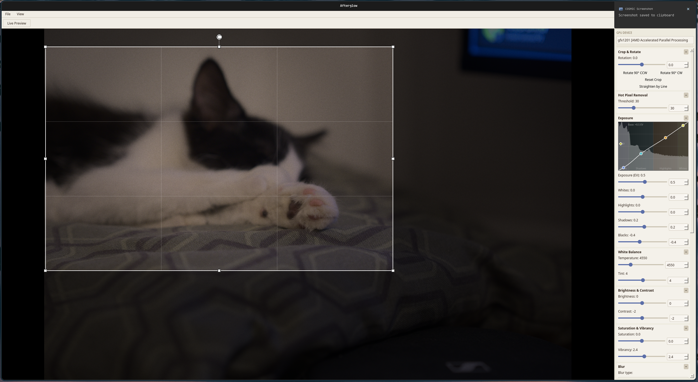

# Afterglow

A Qt6 / OpenCL photo editor. Non-destructive, GPU-accelerated, effects-stacked pipeline.



## Requirements

- C++17 compiler, CMake ≥ 3.16 (≥ 3.25 for workflow presets), Ninja
- Qt6: `Core`, `Gui`, `Widgets`, `Concurrent`, `OpenGLWidgets`
- OpenCL — **required** (`opencl-clhpp` on Arch). There is no CPU fallback.
- OpenGL (libGL)
- LibRaw — *optional*, detected via `pkg-config`; enables RAW file support when present

## Build

```bash
cmake -B build -G Ninja
cmake --build build
./build/bin/afterglow
```

Or via the wrapper scripts in `scripts/` (see [Development scripts](docs/development.md)).

## Tests

```bash
ctest --test-dir build --output-on-failure -j$(nproc)
```

## Install

`cmake --install build` drops the `afterglow` binary into
`${CMAKE_INSTALL_PREFIX}/bin/`. The default prefix is `/usr/local`, so it
needs `sudo`; for a user-local install pass `--prefix ~/.local` and make
sure `~/.local/bin` is on your `PATH`.

```sh
cmake --install build --prefix ~/.local      # user-local, no sudo
sudo cmake --install build                   # system-wide, default prefix
```

To undo it: `cmake --build build --target uninstall` reads
`build/install_manifest.txt` and removes exactly what was installed (run
with `sudo` if the install was `sudo`).

## Coverage

For coverage build setup (99% line threshold, `gcovr` requirement) see [docs/development.md](docs/development.md).

## Known limitations

- OpenCL is a hard build requirement — no CPU fallback exists; if the GPU fails, `processImage` returns an empty image.
- No CL/GL interop — plain readback is used (AMD RDNA4 on Wayland doesn't support `cl_khr_gl_sharing`).

## Further reading

- [Architecture](docs/architecture.md) — targets, pipeline, effects list, adding effects, GPU device selection
- [Releases](docs/releases.md) — versioning, cutting a release, re-doing releases
- [Development](docs/development.md) — coverage setup, development scripts