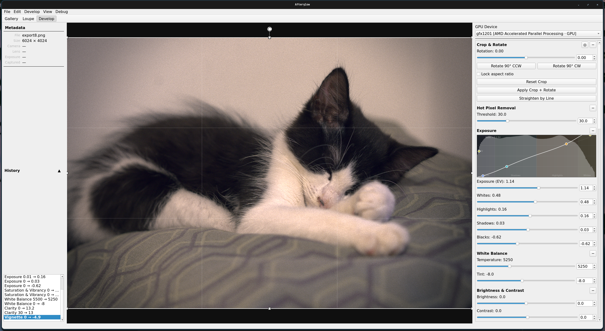
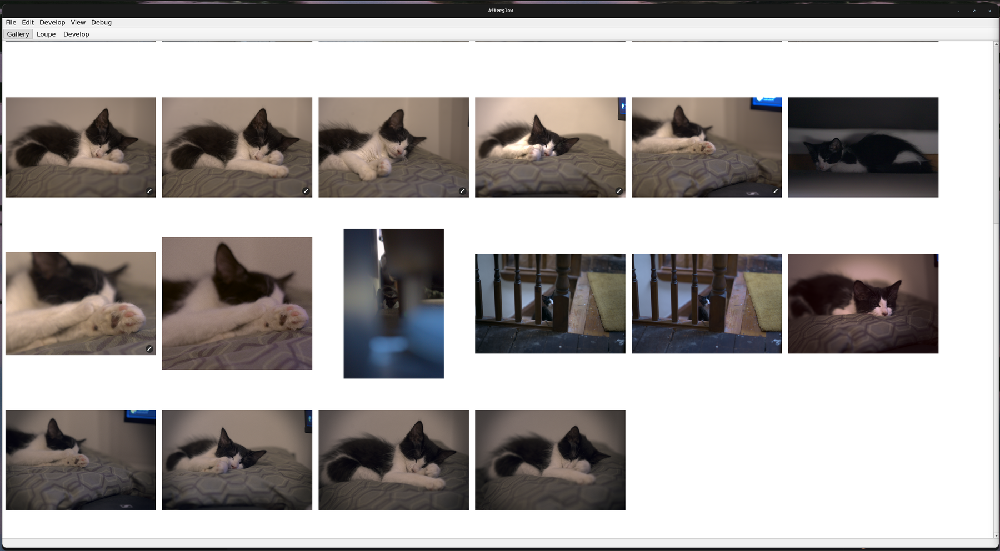
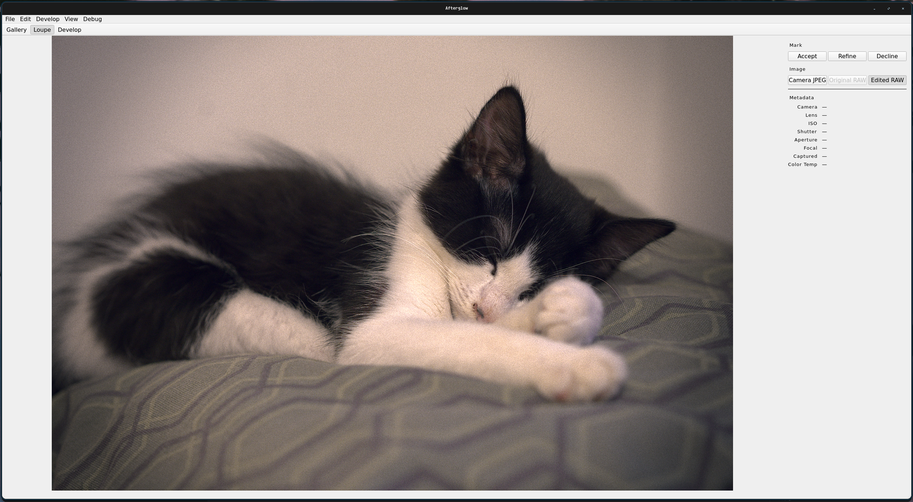

# Afterglow

Afterglow is a non-destructive, GPU-accelerated photo editor for Linux, built
with Qt 6 and OpenCL. Browse a folder, review and mark photographs, inspect RAW
metadata, then develop and export full-resolution images through a stack of 15
effects.



<p align="center">
  
  
</p>

## Highlights

- Gallery, Loupe, and Develop views for browsing, reviewing, and editing
- RAW decoding through LibRaw with a 16-bit processing path
- One-upload OpenCL pipeline with selectable GPU, CPU, and accelerator devices
- Non-destructive sidecar edits, persistent undo history, and before/after preview
- Crop and rotation, exposure controls, white balance, denoise, sharpening,
  color work, film grain, and more
- JPEG, PNG, and TIFF export with quality, resize, and conflict controls
- Background previews and disk caches for responsive folder browsing

## Requirements

- C++17 compiler, CMake ≥ 3.16 (≥ 3.25 for workflow presets), Ninja
- Qt6: `Core`, `Gui`, `Widgets`, `Concurrent`, `OpenGLWidgets`
- OpenCL headers and an ICD loader; at least one GPU or CPU OpenCL runtime is
  needed to process images
- OpenGL (libGL)
- LibRaw (required)

## Build

```bash
cmake -B build -G Ninja
cmake --build build
./build/bin/afterglow
```

Or download the AppImage from the
[latest GitHub release](https://github.com/roadrunner-97/afterglow/releases/latest),
make it executable, and run it. The AppImage bundles Qt, LibRaw, and a POCL CPU
fallback while still using a compatible host GPU runtime when available.

## Tests

```bash
ctest --test-dir build --output-on-failure -j8
```

## Install

`cmake --install build` drops the `afterglow` binary into
`${CMAKE_INSTALL_PREFIX}/bin/`. The default prefix is `/usr/local`, so it
needs `sudo`; for a user-local install pass `--prefix ~/.local` and make
sure `~/.local/bin` is on your `PATH`.

```sh
cmake --install build --prefix ~/.local      # user-local, no sudo
sudo cmake --install build                   # system-wide, default prefix
```

To undo it: `cmake --build build --target uninstall` reads
`build/install_manifest.txt` and removes exactly what was installed (run
with `sudo` if the install was `sudo`).

## Coverage

For coverage build setup (100% line threshold, `gcovr` requirement) see [docs/development.md](docs/development.md).

For dependency packages, troubleshooting, and developer scripts, see the links
below.

## Further reading

- [Architecture](docs/architecture.md) — targets, pipeline, effects list, adding effects, GPU device selection
- [Quickstart](QUICKSTART.md) — Gallery, Loupe, Develop, shortcuts, and export
- [Installation](INSTALL.md) — distro packages, OpenCL runtimes, and building
- [Releases](docs/releases.md) — versioning, cutting a release, re-doing releases
- [Development](docs/development.md) — coverage setup, development scripts
